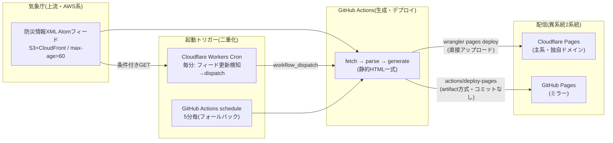

# 設計書 — 文字中心・軽量防災サイト(フェーズ1)

- 作成日: 2026-08-14
- 前提: [要件定義書](requirements.md)、[意思決定記録](decisions.md) #1〜#15
- 対応する決定: ホスティング=案A「Cloudflare Pages+GitHub Pagesのみで完結」(#15)、ランタイム非依存の生成系(#12含意)

## 1. 全体アーキテクチャ



障害点の整理(#15の意図に対応):

| 部位 | 落ちたときの挙動 |
|---|---|
| 上流フィード(AWS) | 生成は前回内容を維持。フィード停滞を検知し劣化警告を自動掲出(R-4) |
| GitHub(Actions) | **更新のみ停止**。配信は2系統とも継続、取得時刻表示(R-1)が鮮度の受け皿 |
| Cloudflare Pages | GitHub Pagesミラーで閲覧可能(逆も同様)。上流がAWS系のため配信面にAWS系を使わない |
| Workers Cronトリガー | Actions schedule(5分毎)が拾う。反映が最大+5分遅れるだけ |

## 2. リポジトリ・成果物構成

```
generator/          # 生成システム(Python 3.11+, 標準ライブラリのみ。プロトタイプを発展)
  fetch.py          #   フィード・電文取得(条件付きGET、リトライ、ソース差し替え可能I/F)
  parse/            #   電文種別ごとのパーサ(警報・地震・津波・天気予報)
  render/           #   中間モデル→HTMLテンプレート(手書き最小テンプレート)
  freshness.py      #   フィード<updated>停滞検知 → 劣化警告フラグ
  main.py           #   一括実行エントリ(ローカル/Actions/将来のVPSで同一動作)
site/               # 生成物(Actionsのartifactとしてのみ存在。リポジトリにはコミットしない)
worker/             # Cloudflare Workers Cronトリガー(フィード更新検知→workflow_dispatch)
.github/workflows/
  build-deploy.yml  # 生成+2系統デプロイ(workflow_dispatch + schedule 5分毎)
  monitor.yml       # 死活・鮮度監視(15分毎)
prototype/          # フェーズ0の実証コード(参照用に凍結)
```

- 生成物はコミットしない(履歴肥大の回避)。GitHub Pagesへはartifact方式(`actions/upload-pages-artifact`+`actions/deploy-pages`)、Cloudflare Pagesへは`wrangler pages deploy`の直接アップロード(Git連携ビルドを使わないため「500ビルド/月」制限の対象外。ファイル数2万/1ファイル25MiB制限のみ——公式ドキュメントで確認済み)。
- GitHub Pagesの「毎時10ビルド」soft limitは独自Actionsワークフロー使用時は適用外(公式ドキュメントで確認済み)。公開リポジトリのためActions実行時間は無料。

## 3. 更新機構(N-5: 反映5分以内)

1. **Workers Cron(毎分)**: 高頻度フィードに条件付きGET(`If-Modified-Since`)→ 直近90秒以内の`<updated>`があれば GitHub API `workflow_dispatch` を呼ぶ。ステートレス設計(Workers KVの無料書き込み上限1,000回/日を回避)。CPU消費は数ms(無料枠10ms内)。
2. **Actions schedule(5分毎)**: トリガー欠落・Workers障害時のフォールバック。無条件に生成を実行。
3. **build-deploy.yml**: `concurrency: group=deploy, cancel-in-progress: true` で多重起動を吸収。手順: 長期フィード取得→全電文取得(並列・失敗リトライ)→生成→2系統デプロイ。所要目標90秒以内。
4. **ステートレス再生成**: 前回状態を持たず、毎回「長期フィード(数日分の全入電)」から現在有効な電文集合を再構築する。冪等で、取りこぼし・二重処理の問題が構造的に発生しない。取得量削減のため電文本文はETagベースのActionsキャッシュを併用(任意最適化)。

想定反映時間: 検知(≤60s)+dispatch/キュー(10〜60s)+生成・デプロイ(30〜90s)= **約2〜4分**(要件N-5の5分以内)。

## 4. ページ構成・URL設計

| URL | 内容 | 想定サイズ(gzip後) |
|---|---|---|
| `/` | 全国概況: 警報発表中の府県一覧(特別警報・危険警報・警報の別)、直近の気象防災速報、最新地震3件、津波現況、各ページへのリンク | ≤5KB |
| `/p/{官署コード}` | 府県ページ: 当該府県の警報・注意報の詳細(市町村等の発表区域単位)+気象防災速報(直近24時間)+府県天気予報+週間天気予報 | ≤8KB |
| `/eq` | 地震: 直近の震度速報・震源震度情報 10件 | ≤6KB |
| `/tsunami` | 津波: 警報・注意報・予報の現況(平時は「現在、津波警報・注意報等は発表されていません」) | ≤3KB |
| `/about` | 運営者・非公式明示・免責・出典・限界(圏外には効かない)・更新の仕組み | ≤4KB |

- 府県ページに警報と天気予報を**統合**する(利用者は自分の県のページ1リクエストで用が足りる——低速回線での往復回数最小化)。
- URLは短く(`/p/130000` 等)、トップから2タップ以内で全情報に到達。
- 平時にも意味のあるページ(天気予報)を同居させることで、ブックマーク・ホーム画面追加の平時価値を持たせる(#10: サイト内に到達支援「機能」は入れないが、平時価値はコンテンツで実現する)。

## 5. HTML・CSS設計(N-1〜N-3, #6)

- `<!doctype html>`+`lang="ja"`+`meta viewport`のセマンティックHTML。見出し・定義リスト・最小限のtable。
- CSSはインライン1KB程度: 可読フォントサイズ(相対指定)、警報種別の色分け(色のみに依存しない——名称テキスト併記)、`prefers-color-scheme`対応(数行)。
- JSなし。鮮度はR-1の取得時刻表示で判断可能(将来、0.5KB以下の任意インラインJSで「◯分前」強調を漸進的強化として検討可。無くても情報は欠けない)。
- 文字エンコーディングUTF-8、gzip/brotliはCDN側で自動。
- `_headers`(Cloudflare Pages)で`Cache-Control: max-age=60`程度の短TTL+`ETag`。

## 6. 監視・通知(N-11)

- **monitor.yml(15分毎)**: ①公開中ページの取得時刻が閾値(30分)超なら異常、②フィード`<updated>`の停滞検知、③2系統の死活確認(HTTP 200)。異常時はActionsのfailure(=GitHubからのメール通知)+Issueの自動起票。
- ビルド失敗はActionsの標準通知。
- 劣化警告(R-4)は監視とは独立に、生成時にフィード鮮度から自動判定して埋め込む。

## 7. デプロイ・環境

- 開発中は `*.pages.dev` / `*.github.io` で動作させ、公開時に独自ドメインをCloudflare Pages(主系)に割当て。GitHub Pagesはミラーとして常時同期(aboutページに相互のミラーURLを明記し、片系障害時の代替先を利用者に示す)。
- 秘密情報: Cloudflare APIトークン(Pages deploy用)・GitHub PAT(workflow_dispatch用、fine-grained・最小権限)のみ。リポジトリSecretsで管理。
- ドメイン名は未決(公開前に依頼者が決定。短さ・打ちやすさを推奨基準とする)。

## 8. 「新たな防災気象情報」(2026-05-29運用開始)対応(N-16)

一次資料調査の詳細は [research/2026-08-14-new-format-research.md](research/2026-08-14-new-format-research.md)(技術情報第634号・公式概要資料・実フィード採取に基づく)。設計への反映は以下のとおり。

### 8.1 購読・解析する電文(新体系ベース)

| 用途 | 電文コード | 備考 |
|---|---|---|
| 警報・注意報(F-1) | **VPWW55〜61**(大雨/土砂/高潮/暴風/波浪/大雪/その他注意報の7分割) | 旧VPWW54は使わない(下記8.3) |
| 地震(F-2) | VXSE51/VXSE53系 | 今回の改定の対象外・変更なし |
| 津波(F-3) | VTSE41等 | 同上 |
| 天気予報(F-4) | **VPFD51**(府県天気予報(Ｒ１))・**VPFW50**(府県週間天気予報) | 今回の改定で変更なし。VPFD60/61・VPFW60は別物(早期注意情報系)なので混同しない |
| 気象防災速報(F-5) | **VPBS50**(府県気象防災速報)・**VPHW50/51**(気象防災速報(竜巻注意)/(竜巻目撃)) | 決定#16でフェーズ1に含む。速報型のため「直近24時間分」を表示し、発表時刻を必ず併記 |

- InfoKindVersionは新電文で**1.5_0**。パーサはバージョンを検査し、想定外の版は「解析失敗」として監視通知に乗せる(黙って誤表示しない)。
- 時系列情報(VPWP50: 警報等の切替予告)はフェーズ1の必須スコープ外とし、実装後の拡張候補(§9)とする。旧・記録的短時間大雨情報(VPOA50)は経過措置電文のため使わない(VPBS50で代替)。

### 8.2 警報種別コード→表示名・警戒レベル対応(公式別表3準拠)

- 大雨: 33=レベル５大雨特別警報/43=レベル４大雨危険警報/03=レベル３大雨警報/10=レベル２大雨注意報
- 土砂: 39=レベル５土砂災害特別警報/49=レベル４土砂災害危険警報/09=レベル３土砂災害警報/29=レベル２土砂災害注意報
- 高潮: 38=レベル５高潮特別警報/48=レベル４高潮危険警報/08=レベル３高潮警報/19=レベル２高潮注意報
- 変更なし: 02/05/06/07(暴風・暴風雪・波浪・大雪の警報)、32/35/36/37(同特別警報)、12〜27(注意報)、00=解除
- **04(洪水警報)/18(洪水注意報)は新体系では発表されない**(経過措置電文専用)。新電文への出現は異常として監視通知。
- 表示名は電文のName値(「レベル４土砂災害危険警報」等のレベル数字込み正式名称)を**そのまま**使い、独自の言い換えをしない(N-14)。レベルはコードから決定表で導出し、レベル非対応の警報(暴風・波浪等)はレベル表記なしで区別する(公式方針どおり)。
- 表示の強調は「特別警報>危険警報>警報>注意報」の4段+レベル数字。色分けは気象庁配色(L5黒/L4紫/L3赤/L2黄)に揃えるが、色のみに依存せず名称テキストを常に併記(N-3系のアクセシビリティ方針)。

### 8.3 新旧併流への対処(重要)

- 現在フィードには**新旧電文が併流**している(旧VPWW53/54、VXWW50、VPOA50等は「新電文運用開始後2年程度」=2028年5月頃まで併配信。終了日未発表)。**採用は新コード(VPWW55〜61)のみ**とし、旧電文は読み捨てる——旧電文依存は時限リスクであり、二重表示の原因にもなる。
- フィードのentry titleには旧名称のまま流れるものがある(例: VXWW50はtitle「土砂災害警戒情報」だが中身は「レベル４土砂災害危険警報」)。**電文の採否はtitle文字列でなく電文コードで判定**する。
- 高潮特別警報は新旧で意味が変わった(旧レベル4相当→新レベル5「氾濫発生・切迫時」)ため、サイト内の説明・凡例に旧定義を書かない。

### 8.4 テストへの反映

- ゴールデンテストの実電文は2026-08-13千葉県大雨事例(コード33/43/39/49の実配信を確認済み)から採取する。
- VPWW60(大雪)・コード38(レベル５高潮特別警報)は実電文が季節的に未観測のため、公式別表に基づく合成テストケースで代替し、初観測時に実電文テストへ差し替える。

## 9. 将来拡張との接続(N-13)

- `fetch.py`はソースアダプタ構造(`JmaXmlFeedSource` / 将来`DmdataSource`)。DMDATA導入時はWebSocket受信の常駐プロセスが必要になるため、Linode Nanode(月$5・東京)に`main.py`をsystemd timer/serviceで載せ替える。生成・描画系は無変更。
- Lアラート(避難情報)は2026年12月の総務省新規約公表後に再評価(#1)。掲載する場合も本設計のページ構成に府県ページ内セクションとして追加可能。

## 10. テスト計画(受け入れ基準に対応)

1. **単体**: パーサは実電文(フィードから採取した現物+気象庁サンプル電文)によるゴールデンテスト。新体系の全警報種別コードの表示名変換を網羅。
2. **性能**: 既存の128kbps計測ハーネス(prototype/measure)を流用し、全ページ種別で表示完了2秒以内を確認。
3. **連続運転**: 公開前に1週間以上の自動更新運転を行い、反映遅延の分布・失敗率を計測(受け入れ基準2)。
4. **障害演習**: フィード停滞の模擬(過去時刻の`<updated>`)で劣化警告と監視通知の発火を確認。片系デプロイ失敗時に他系が更新継続することを確認。
